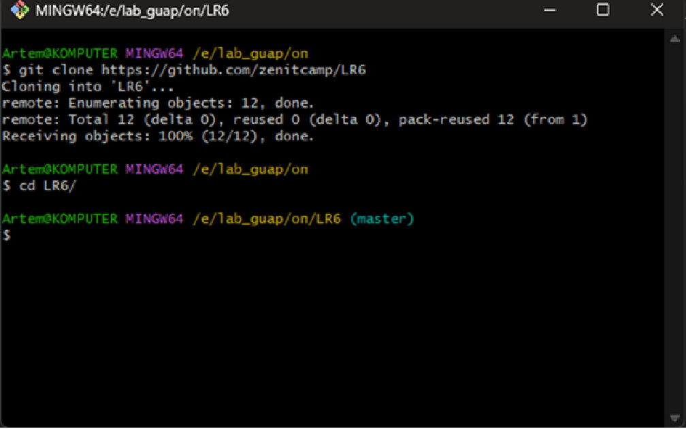
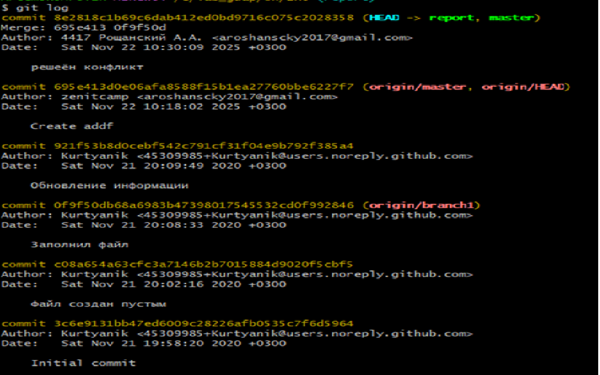
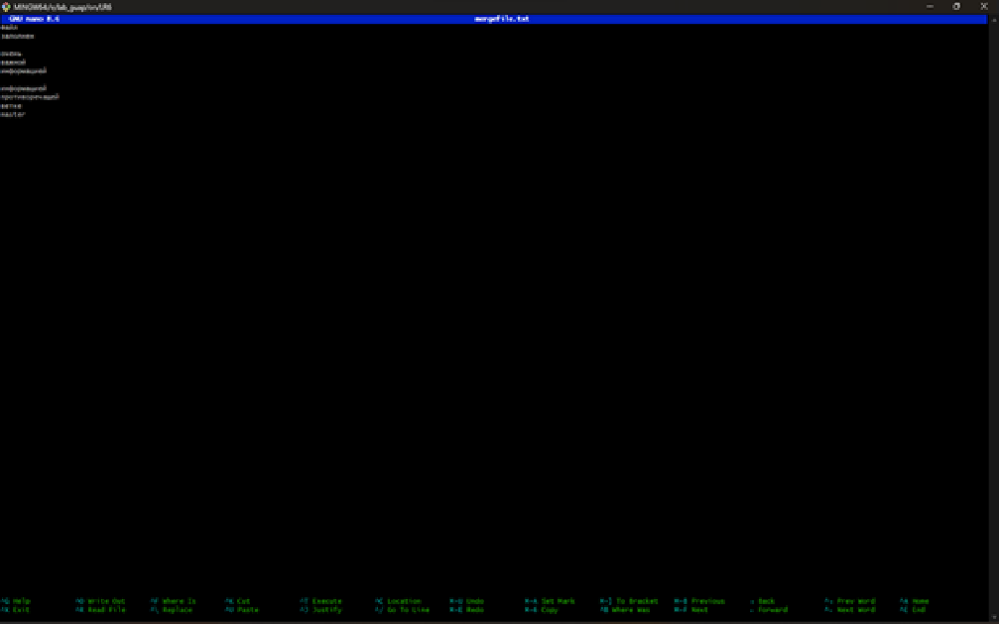
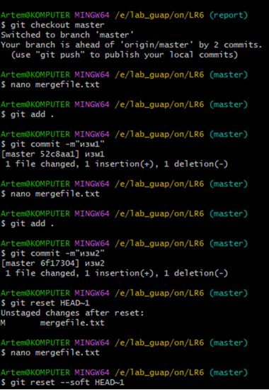
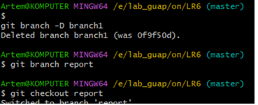
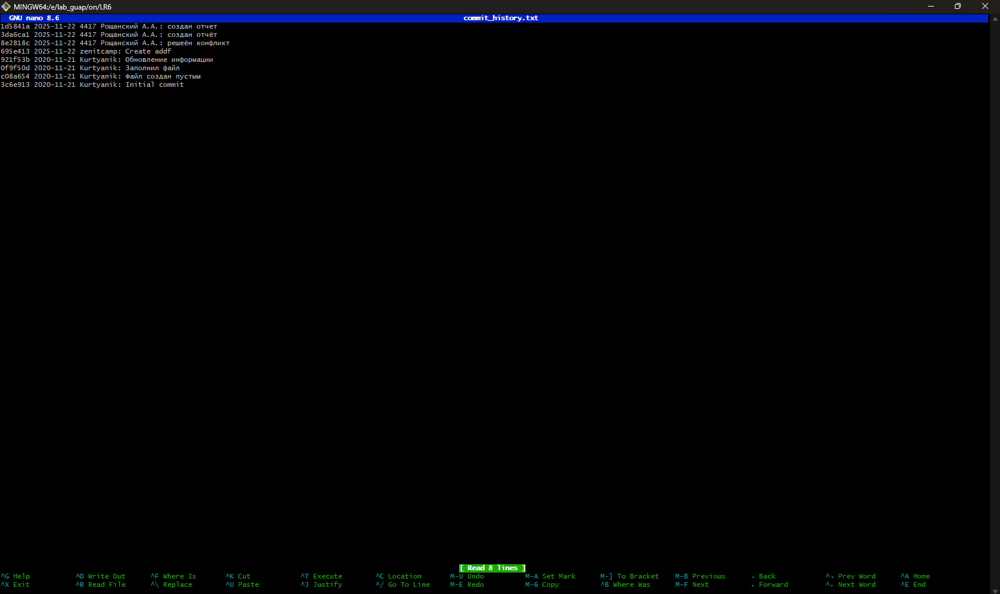

## Цель работы

Освоить базовые возможности системы управления версиями Git, получить практический опыт:
- работы с Git API;
- взаимодействия с локальным и удалённым репозиторием (GitHub);
- выполнения ключевых операций: клонирование, коммиты, ветвление, слияние, разрешение конфликтов, откат изменений.

## Выполненные задачи и результаты

### 1. Клонирование репозитория
**Действие:** выполнено клонирование удалённого репозитория на локальную машину.  
**Команда:** `git clone <url>`

### 2. Получение истории изменений
**Действие:** проанализирована хронология коммитов.  
**Команды:**  
- `git log` — просмотр полной истории;  
- `git log --oneline` — компактный вывод.

### 3. Разрешение конфликта при слиянии веток
**Действие:** смоделирована ситуация конфликта при выполнении `git merge`.  
**Шаги:**  
1. Внесены противоречивые изменения в две ветки.  
2. Выполнено слияние (`git merge <ветка>`).  
3. Вручную разрешены конфликты в файлах.  
4. Зафиксированы изменения через `git add` и `git commit`.

### 4. Работа с коммитами и откат изменений
**Действия:**  
- Созданы новые коммиты с изменениями (`git commit -m "Сообщение"`).  
- Выполнен откат к предыдущей версии:  
  - `git reset --hard HEAD~1` (полный откат);  
  - `git revert <хеш>` (создание нового коммита с откатом).

### 5. Управление ветками
**Действия:**  
1. Создана ветка для подготовки отчёта: `git branch report`.  
2. Переключён контекст на новую ветку: `git checkout report`.  
3. Удалена неактуальная ветка: `git branch -d <ветка>`.

### 6. Анализ истории коммитов
**Действие:** получен детализированный лог изменений.  
**Команды:**  
- `git log --graph --decorate` — визуализация веток;  
- `git show <хеш>` — просмотр деталей конкретного коммита.

## Используемые инструменты
- **Git CLI** — командная строка для выполнения операций;
- **GitHub** — удалённый репозиторий для хранения кода;
- **Скриншоты интерфейса** — визуальная фиксация этапов работы.

## Вывод

В ходе работы достигнуты все поставленные цели:

1. **Освоены базовые возможности Git:**  
   - клонирование и синхронизация репозиториев;  
   - навигация по истории изменений;  
   - управление ветками и слияние;  
   - разрешение конфликтов;  
   - контроль версий через коммиты и откат.

2. **Получен опыт работы с Git API:**  
   - отработаны команды для взаимодействия с локальным и удалённым репозиторием;  
   - изучены параметры команд (например, `--hard`, `--oneline`).

3. **Отработаны сценарии работы с репозиториями:**  
   - **локальный репозиторий:** создание коммитов, ветвление, откат;  
   - **удалённый репозиторий (GitHub):** синхронизация через `push`/`pull`, управление ветками.

4. **Закреплены навыки документирования:**  
   - скриншоты этапов работы;  
   - описание команд и результатов в Markdown.

**Итог:** приобретённые знания и навыки позволяют:  
- эффективно управлять версиями проектов;  
- участвовать в командной разработке с использованием Git и GitHub;  
- решать типовые задачи (конфликты, откаты, ветвление) в реальных проектах.
